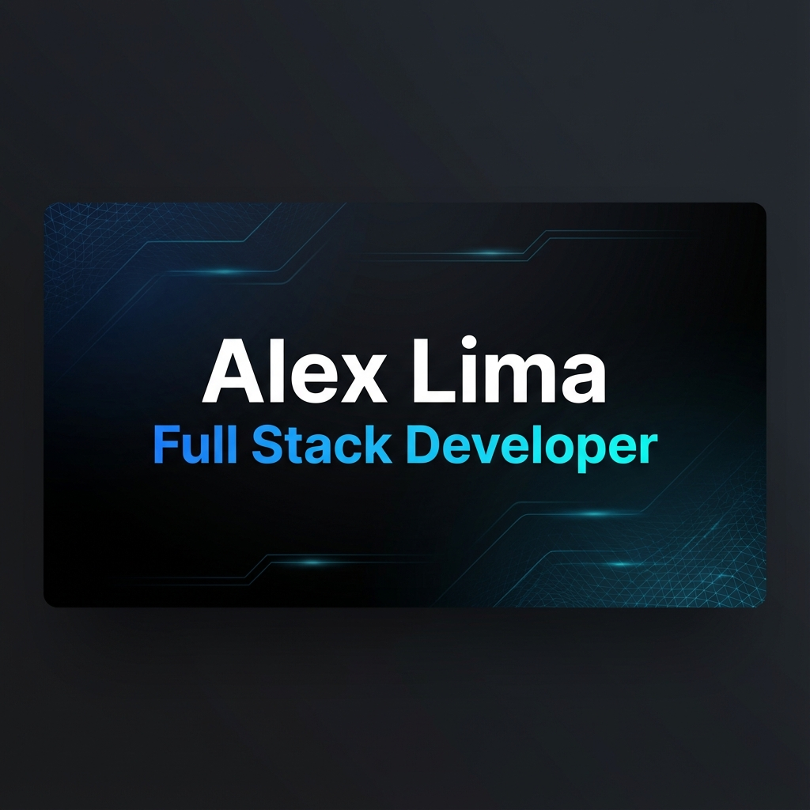

<div align="center">
  

  # Alex Lima — Portfolio

  **Portfolio profissional de Desenvolvedor Full Stack, com foco em produtos digitais, projetos reais e experiência de alta qualidade.**

  [Ver portfolio ao vivo](https://alexlima-portfolio.vercel.app) · [GitHub](https://github.com/AlexLimaTKZ) · [LinkedIn](https://www.linkedin.com/in/alexslima1/)

  
  
  
  
  
</div>

## Sobre o projeto

Este repositório contém meu portfolio pessoal e profissional. O objetivo não é apenas apresentar tecnologias, mas demonstrar como penso e trabalho na construção de produtos digitais: descoberta do problema, design, desenvolvimento, performance, SEO, responsividade e entrega em produção.

A experiência foi construída para atender dois públicos principais:

- **Clientes**, que precisam entender rapidamente como posso ajudar um negócio ou produto.
- **Times e recrutadores**, que querem avaliar stack, experiência, projetos entregues e qualidade técnica.

## Principais recursos

- Hero interativa com identidade visual própria.
- Seção de serviços e processo de trabalho.
- Projetos reais com demos publicadas.
- Depoimentos de clientes e parceiros reais.
- Experiência profissional e trajetória técnica.
- Interface responsiva para mobile, tablet e desktop.
- Tema claro e escuro.
- Conteúdo em **Português, Inglês e Espanhol**.
- Animações com Framer Motion e smooth scrolling progressivamente aprimorado.
- Respeito a `prefers-reduced-motion` e redução de efeitos pesados em dispositivos touch.
- SEO com Metadata API do Next.js, Open Graph, Twitter Cards, JSON-LD, `robots.txt` e sitemap.
- Headers HTTP de segurança configurados no Next.js.

## Stack do portfolio

| Área | Tecnologias |
| --- | --- |
| Framework | Next.js 16 — App Router |
| UI | React 19, TypeScript |
| Estilização | Tailwind CSS 4, Radix UI, shadcn/ui patterns |
| Animações | Framer Motion, Lenis |
| Ícones | Lucide React, React Icons |
| Tema | next-themes |
| SEO | Next.js Metadata API, Open Graph, JSON-LD, Sitemap, Robots |
| Deploy | Vercel |

## Estrutura

```text
src/
├── app/
│   ├── layout.tsx          # Metadata, providers e estrutura global
│   ├── page.tsx            # Composição da landing page
│   ├── globals.css         # Tokens, temas e estilos globais
│   ├── robots.ts           # Regras para crawlers
│   └── sitemap.ts          # Sitemap do portfolio
├── components/
│   ├── hero.tsx
│   ├── services.tsx
│   ├── projects.tsx
│   ├── testimonials.tsx
│   ├── about.tsx
│   ├── contact.tsx
│   └── ui/                 # Componentes reutilizáveis
└── lib/
    ├── constants.ts        # URL canônica, contatos e dados estruturados
    ├── translations.ts     # Conteúdo PT / EN / ES
    └── utils.ts
```

## Performance e experiência

O portfolio usa animação como parte da experiência visual, mas evita manter trabalho desnecessário quando o usuário não está interagindo.

Algumas decisões adotadas:

- imagens renderizadas com `next/image`;
- fontes carregadas com `next/font`;
- React Compiler habilitado;
- spotlight e tilt da Hero limitados por `requestAnimationFrame` apenas durante interação;
- Lenis desativado para usuários com movimento reduzido e dispositivos de ponteiro coarse/touch;
- fallback global para `prefers-reduced-motion`;
- remoção de dependências não utilizadas;
- security headers configurados em `next.config.ts`.

## SEO

A URL canônica atual do projeto é:

```text
https://alexlima-portfolio.vercel.app
```

Ela é utilizada como origem para metadata, Open Graph, sitemap e dados estruturados, evitando URLs conflitantes entre o deploy e os sinais enviados aos mecanismos de busca.

## Executando localmente

### Requisitos

- Node.js compatível com Next.js 16
- npm

### Instalação

```bash
git clone https://github.com/AlexLimaTKZ/alexlima-portfolio.git
cd alexlima-portfolio
npm install
npm run dev
```

Acesse `http://localhost:3000`.

### Validação

```bash
npm run lint
npm run build
```

## Projetos apresentados

Entre os trabalhos apresentados no portfolio estão:

- **TKZ Jobs Dev** — plataforma de vagas e oportunidades para desenvolvedores.
- **CMC Fotos e Artes** — experiência web para produtos e serviços personalizados.
- **Adriana Carvalho Advocacia** — site institucional com foco em presença digital e captação.
- **Se7e Go** — sistema de geração e gestão de orçamentos para vidraçarias e esquadrias.

## Contato

- **Portfolio:** [alexlima-portfolio.vercel.app](https://alexlima-portfolio.vercel.app)
- **GitHub:** [AlexLimaTKZ](https://github.com/AlexLimaTKZ)
- **LinkedIn:** [alexslima1](https://www.linkedin.com/in/alexslima1/)
- **E-mail:** contato@tkzdev.com

---

<div align="center">
  Desenvolvido por <strong>Alex Lima</strong> — Full Stack Developer · Founder & Tech Lead da TKZ Dev.
</div>
